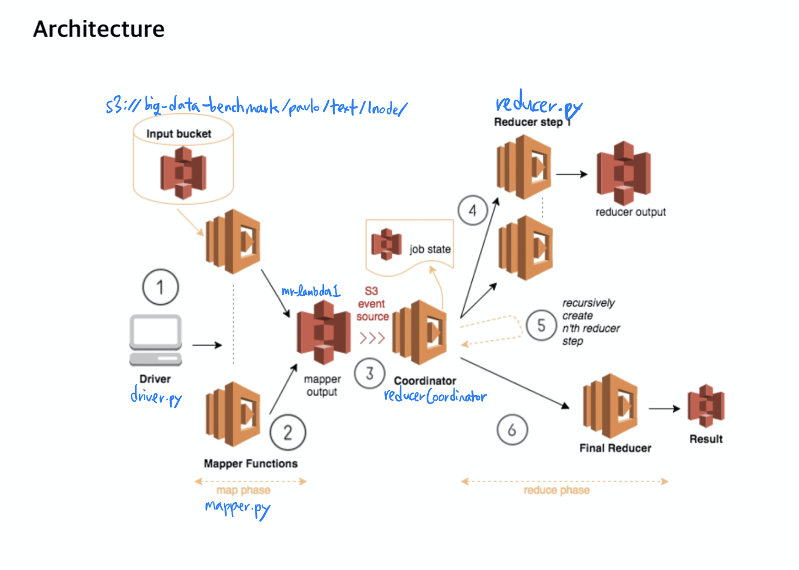

# MARLA
논문 (A framework and a performance assessment for serverless MapReduce on AWS Lambda)  https://www.sciencedirect.com/science/article/pii/S0167739X18325172

논문에서 MapReduce on AWS Lambda를 <b>MARLA</b>라고 지칭함.<br/>
<br/>
<b>Figure1</b>의 아키텍쳐를 실제로 구현

<image src="./assets/MARLA_Architecture.jpeg" />
<br/>

블로그에 아래의 내용을 정리하였습니다.
https://manchann.tistory.com/4


<br/>

원문 내용의 주소와 깃헙 주소는 다음과 같습니다.

[https://aws.amazon.com/blogs/compute/ad-hoc-big-data-processing-made-simple-with-serverless-mapreduce/](https://aws.amazon.com/blogs/compute/ad-hoc-big-data-processing-made-simple-with-serverless-mapreduce/)

[https://github.com/awslabs/lambda-refarch-mapreduce](https://github.com/awslabs/lambda-refarch-mapreduce)  
  

다음의 블로그를 참조하여 이해해 큰 도움을 얻었습니다. 코드에 대한 자세한 설명을 포함하므로 본 포스트를 읽기 전에 참고해 보시면 좋을 것 같습니다.

[https://jeongchul.tistory.com/622?category=495790](https://jeongchul.tistory.com/622?category=495790)  
  

python3.6으로 구동이 되는 제가 작업한 코드는 다음의 깃헙에 있습니다.

[https://github.com/kmu-bigdata/KMU-MARLA](https://github.com/kmu-bigdata/KMU-MARLA)  
  

## 전반적인 아키텍쳐



## Input bucket

s3://big-data-benchmark/pavlo/text/1node/uservisits/ 에 MapReduce 작업을 위한 리소스가 준비 되어있어 활용 합니다.

```
aws s3 ls s3://big-data-benchmark/pavlo/text/1node/uservisits/
```


  
다음과 같이 122MB정도의 파일들이 총 202개 있음을 확인 했습니다.

```
aws s3 cp s3://big-data-benchmark/pavlo/text/1node/uservisits/part-00000 .
```


각 input file은 다음과 같은 포멧들로 구성되어 있습니다.

본 workload에서는 source ip를 key값으로 adRevenue를 더하는 작업을 합니다.

소스 코드 들 중 핵심 부분들을 정리해보았습니다.

## Driver

```
python3 driver.py
```

driver.py를 실행하여 실험을 시작합니다.

-   lambda에 코드 배포

```
#driver.py line: 110
zipLambda(config["mapper"]["name"], config["mapper"]["zip"])
zipLambda(config["reducer"]["name"], config["reducer"]["zip"])
zipLambda(config["reducerCoordinator"]["name"], config["reducerCoordinator"]["zip"])

# zip 파일을 lambda에 배포
# Mapper를 Lambda Function에 등록합니다.
l_mapper = lambdautils.LambdaManager(lambda_client, s3_client, region, config["mapper"]["zip"], job_id,
        mapper_lambda_name, config["mapper"]["handler"])
l_mapper.update_code_or_create_on_noexist()

# Reducer를 Lambda Function에 등록합니다.
l_reducer = lambdautils.LambdaManager(lambda_client, s3_client, region, config["reducer"]["zip"], job_id,
        reducer_lambda_name, config["reducer"]["handler"])
l_reducer.update_code_or_create_on_noexist()

# Coordinator를 Lambda Function에 등록합니다.
l_rc = lambdautils.LambdaManager(lambda_client, s3_client, region, config["reducerCoordinator"]["zip"], job_id,
        rc_lambda_name, config["reducerCoordinator"]["handler"])
l_rc.update_code_or_create_on_noexist()

#lambdaautils.py line: 36
def create_lambda_function(self):
        '''
        AWS Lambda Function을 새로 생성하고 코드를 패키징한 zip 파일을 이용해 업데이트 합니다.
        '''
        runtime = 'python3.6'
        response = self.awslambda.create_function(
            FunctionName=self.function_name,
            Code={
                "ZipFile": open(self.codefile, 'rb').read()
            },
            Handler=self.handler,
            Role=self.role,
            Runtime=runtime,
            Description=self.function_name,
            MemorySize=self.memory,
            Timeout=self.timeout
        )
        self.function_arn = response['FunctionArn']
        print(response)
```

로컬에 있는 python 파일들을 zip으로 묶고 그 zip을 배포합니다.


각각 Coordinator, Reducer, Mapper에 대한 함수가 배포되었습니다.

```
#driver.py line:140
#lambda invoke
def invoke_lambda(batches, m_id):
    batch = [k.key for k in batches[m_id-1]]

    resp = lambda_client.invoke( 
            FunctionName = mapper_lambda_name,
            InvocationType = 'RequestResponse',
            Payload =  json.dumps({
                "bucket": bucket,
                "keys": batch,
                "jobBucket": job_bucket,
                "jobId": job_id,
                "mapperId": m_id
            })
        )
    out = eval(resp['Payload'].read())
    mapper_outputs.append(out)
    print("mapper output", out)
```

lambdaautils.py에서 계산되어온 batch size를 기반으로 mapper를 invoke 합니다.

s3에 올라가 있는 파일 중 어떤 파일을 작업시킬 것인지에 대하여 "keys"값으로 넘깁니다.

```
# driver.py line:172
# 병렬 실행 Parallel Execution
print("# of  ", n_mappers)
pool = ThreadPool(n_mappers)
Ids = [i+1 for i in range(n_mappers)]
invoke_lambda_partial = partial(invoke_lambda, batches)
```

MultiProcessing으로 n개의 mapper 람다가 병렬적으로 트리깅 됩니다.

## Mapper

```
#mapper.py line: 54
#Map Work
for key in src_keys:
        response = s3_client.get_object(Bucket=src_bucket, Key=key)
        contents = response['Body'].read()
        # Map Function
        for line in contents.decode().split('\n')[:-1]:
            line_count += 1
            try:
                data = line.split(',')
                print('data: ', data)
                srcIp = data[0][:8] # get source ip
                if srcIp not in output:
                    output[srcIp] = 0
                output[srcIp] += float(data[3]) # get adRevenue = float(data[3])
            except Exception as e:
                print(e)
```

작업하는 파일을 line별로 탐색하여 map 작업을 진행합니다. 파일의 내용 중 source ip 부분을 추출하여 key로 삼습니다. adRevenue부분을 value로 더해갑니다.


output

\= \[batch개수, 라인의개수, 걸린 시간, 에러메세지\]

202개의 mapper가 trigging 되었고 output이 return 되어 옵니다.

```
#mapper.py line: 83
write_to_s3(job_bucket, mapper_fname, json.dumps(output), metadata)
```

map 작업이 끝나면, s3에서 지정된 경로에 결과를 저장합니다.


map 작업에 대한 결과 파일 중 일부를 살펴보았습니다.


  
다음과 같이 { key(source ip) : value(adRevenue) } 의 형태로 mapping 된 결과를 확인했습니다.

```
# driver.py line:177
# Mapper의 개수 만큼 요청 Request Handling
mappers_executed = 0
while mappers_executed < n_mappers:
    nm = min(concurrent_lambdas, n_mappers)
    results = pool.map(invoke_lambda_partial, Ids[mappers_executed: mappers_executed + nm])
    mappers_executed += nm

pool.close()
pool.join()

print("all the mappers finished ...")
```

driver.py에서는 지속적으로 완료된 mapper의 개수를 체크합니다.

## Coordinator

s3에 map의 결과가 저장되면 Coordinator의 역할을 하는 lambda 함수를 트리깅 합니다.


```
# reducerCoordinator.py line: 144
# 
mapper_keys = get_mapper_files(files)
print("Mappers Done so far ", len(mapper_keys))

if map_count == len(mapper_keys): # 모든 mapper가 끝났는지 체크

    # 모든 mapper가 완료되었다면, reducer를 시작합니다.
    stepInfo = get_reducer_state_info(files, job_id, bucket)

    print("stepInfo", stepInfo)

    step_number = stepInfo[0]
    reducer_keys = stepInfo[1]

    if len(reducer_keys) == 0: #reducer 단계가 맨 첫번째 단계인 경우
            print("Still waiting to finish Reducer step ", step_number)
            return
```

s3 업로드 이벤트에 의해 트리깅 된 reducerCoordinator 함수는 현재 mapper작업이 모두 끝났는지 체크합니다. 아직 모든 mapper 작업이 끝나지 않았다면, 아무런 작업 없이 함수를 종료합니다.

mapper 작업이 모두 끝났다면 ( 아마도 맨 마지막에 트리깅된 함수일 듯 합니다) reducer 작업을 트리깅 합니다.

```
# reducerCoordinator.py line: 162
# 메타데이터(metadata in S3)의 파일을 기반으로 Reduce의 배치 사이즈를 계산합니다.
r_batch_size = get_reducer_batch_size(reducer_keys)

print("Starting the the reducer step", step_number)
print("Batch Size", r_batch_size)

r_batch_params = lambdautils.batch_creator(reducer_keys, r_batch_size);

n_reducers = len(r_batch_params)
n_s3 = n_reducers * len(r_batch_params[0])
step_id = step_number + 1

for i in range(len(r_batch_params)):
    batch = [b['Key'] for b in r_batch_params[i]]

    # Reducer Lambda를 비동기식(asynchronously)으로 호출(invoke)합니다.
    resp = lambda_client.invoke(
        FunctionName=r_function_name,
        InvocationType='Event',
        Payload=json.dumps({
            "bucket": bucket,
            "keys": batch,
            "jobBucket": bucket,
            "jobId": job_id,
            "nReducers": n_reducers,
            "stepId": step_id,
            "reducerId": i
        })
    )
    print(resp)
```

## Reducer

```
# reducer.py line: 59
# 모든 key를 다운로드하고 Reduce를 처리합니다.
# Reducer는 Mapper의 output 개수에 따라 1/2씩 처리가 되며 Reducer의 step 개수가 결정됩니다.
# Mapper의 output 개수가 64개라면 (step:output개수/1:32/2:16/3:12.8/4:4/5:2/6:1) 총 6단계 reduce 발생
for key in reducer_keys:
    response = s3_client.get_object(Bucket=job_bucket, Key=key)
    contents = response['Body'].read()

    try:
        for srcIp, val in json.loads(contents).items():
            line_count += 1
            if srcIp not in results:
                results[srcIp] = 0
            results[srcIp] += float(val)
    except Exception as e:
        print(e)

time_in_secs = (time.time() - start_time)
pret = [len(reducer_keys), line_count, time_in_secs]
print("Reducer output", pret)
```

Coordinator를 통해 트리깅 되어 output 개수의 1/2씩 처리가 됩니다.

→ 이 부분이 잘 이해가 되지 않아 실험 돌려보면서 오는 값들을 디버깅해보면서 이해해 보아야 할 것 같습니다.

본 작업에서는 202개의 output이 주어졌고 총 8 step의 작업이 이루어 지게 됩니다.

reducer 하나의 step이 끝날 때 마다 s3에 결과 파일들을 업로드 하게 되고 이는 또다시 reducerCoordinator 함수를 트리깅 하여 재귀구조로 반복 호출됩니다.

다음과 같이 s3에 현재 reducer의 state가 몇까지 왔는지 체크 용도의 파일이 생성됩니다.


  
각 step별로 완료된 reducer 결과 파일은 위의 경로에 저장되어 있습니다.

특별한 점은 마지막 step의 결과 파일은 mr-lambda1/bl-release/result 의 형태로 저장됩니다.

```
# reducerCoordinator.py line: 72
def check_job_done(files):
    # TODO: USE re
    for f in files:
        if "result" in f["Key"]:
            return True
    return False
```

그리고 Coordinator는 s3에 result파일이 생김을 감지함에 따라서 reducer가 끝났음을 파악합니다.
